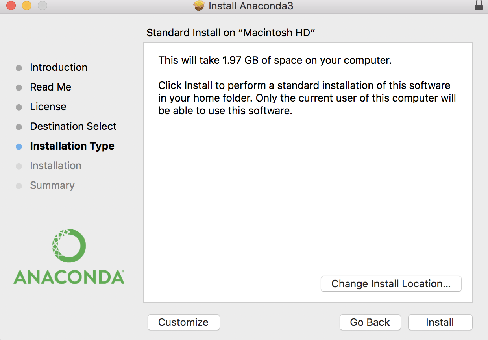

## Install Anaconda's distribution of Python for **ALL USERS** (GIS Lab)
* Download Anaconda from https://www.anaconda.com/download
* Select the appropriate for your OS Graphical Installer. For this course, we will be using Python 3.
* Run the executable. For the location, install under C:\ drive. make a folder “Python3” if necessary.
  When asked, check **All Users** box and check **Add Anaconda to my PATH environment variable** box

## Packages to install
* geopandas
* rasterio
* statsmodels
* googlemaps
* mplleaflet
* bokeh
* folium
* osmnx
* networkx
* pandana 
* geoplot

To install the required packages, run anaconda prompt **as administrator**.
Make sure that conda-forge channel is your default channel, type following:  
`conda config --add channels conda-forge`

Install the packages:    
Type following one by one and when asked 'Proceed ([y]/n)?' type `y` and hit Enter. Most of the packages have a number of dependecnies that will be installed along the way. Just say `y` to them all.

* `conda install geopandas`
* `conda install rasterio`
* `conda install statsmodels`
* `conda install googlemaps`
* `conda install mplleaflet`
* `conda install bokeh`
* `conda install folium`
* `conda install osmnx`
* `conda install networkx`
* `conda install pandana`
* `conda install geoplot`
* `conda install rasterstats`

## Install Anaconda's distribution of Python on your machine
* Download Anaconda from https://www.anaconda.com/download
* Select the appropriate for your OS Graphical Installer and download it. For this course, we will be using Python 3.
  
* Run the executable. Click **Next**, agree to the terms of use and choose **Install for Me Only** option. Click **Install**.
   

I you are on Windows, you window will look slightly different. Choose **Just Me** as your *Install For* option, accept default installation folder, and check both boxes in the *Advanced options*. Click **Install** and wait for the installation to be complete.

Anaconda's distribution of Python comes with lots of usefull packages, but we will need to install a few more to enable our work with spatial data. Anaconda also comes with its own package manager, [conda](https://conda.io/docs/user-guide/concepts.html#conda-packages), which makes packages handling very easy. On Mac OS/linux, you can run conda commands from your regular terminal .  

On Windows, you will find *Anaconda Prompt* under *Start Menu*-->*Anaconda* or you can use your regular command prompt. 
.
Whichever you use, type `conda config --add channels conda-forge` to make sure that conda-forge is added to your channels. Now, to install the required packages, type below commands one by one. When asked 'Proceed ([y]/n)?' type `y` and hit Enter. Most of the packages have a number of dependecnies that will be installed along the way. Just say `y` to them all.

* `conda install geopandas`
* `conda install rasterio`
* `conda install statsmodels`
* `conda install googlemaps`
* `conda install mplleaflet`
* `conda install bokeh`
* `conda install folium`
* `conda install osmnx`
* `conda install networkx`
* `conda install pandana`
* `conda install geoplot`
* `conda install rasterstats`

As an alternative, you can create a new environemnt from the provided [environemnt.yml]('https://github.com/anastasiaclark/GEP662_Spring2018/blob/master/environment.yml') file and it will be created with all the required packages for this course. Just download the file and run the command `conda env create -f environment.yml`. Then before you start working with Spyder or Jupyter notebook, run `source activate gep662` (on Mac) or `activate gep662` (on Widnows). 
